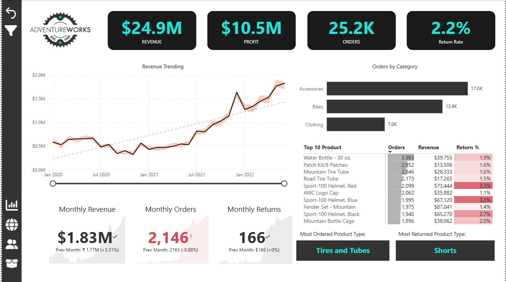
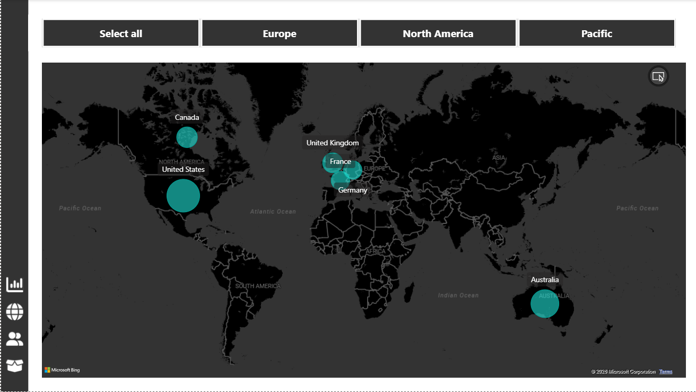
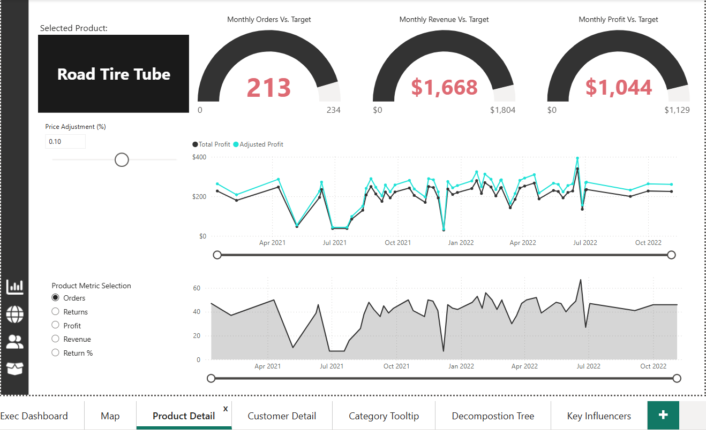
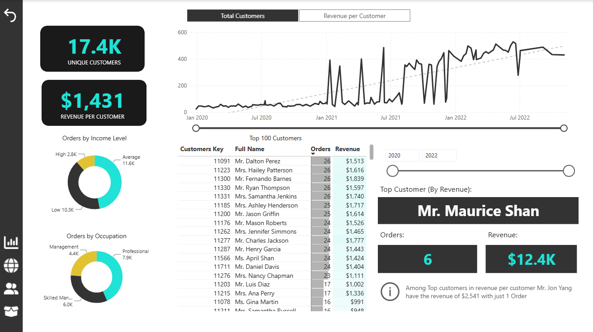

# AdventureWorks Sales Analytics Dashboard — Power BI
**Maven Analytics | Course Project**
*Instructors: Aaron Parry & Chris Dutton*

## Project Overview
A professional-grade, multi-page Power BI dashboard built 
on the AdventureWorks dataset — covering executive 
reporting, product analysis, customer segmentation, 
geographic distribution, and AI-powered insights across 
3 years of bike shop sales data (2020–2022).

## Dashboard Pages

### 1. Exec Dashboard

### 2. Map View

### 3. Product Detail

### 4. Customer Detail

## Key Metrics
- Total Revenue: $24.9M | Total Profit: $10.5M
- Total Orders: 25.2K | Return Rate: 2.2%
- Unique Customers: 17.4K
- Revenue per Customer: $1,431
- Monthly Revenue: $1.83M (+3.31% vs prev month)
- Most Ordered Category: Accessories (17.0K orders)
- Most Returned Product Type: Shorts
- Top Customer by Revenue: Mr. Maurice Shan ($12.4K)
- Highest Revenue per Customer: Mr. Jon Yang 
  ($2,541 from 1 order)

## Dashboard Features
- **Exec Dashboard** — revenue trend with forecast, 
  top 10 products table with return % conditional 
  formatting, MoM performance cards
- **Map View** — geographic bubble map filtered by 
  region (Europe, North America, Pacific)
- **Product Detail** — gauge charts vs monthly targets, 
  what-if price adjustment parameter slider, 
  dual time-series charts, metric toggle
- **Customer Detail** — customer trend line, 
  top 100 customers table, orders by income 
  level and occupation, dynamic top customer card
- **Category Tooltip** — hover-based contextual visuals
- **Decomposition Tree** — dynamic metric breakdown 
  across multiple dimensions
- **Key Influencers** — AI visual identifying revenue 
  and return rate drivers

## Advanced Power BI Concepts Used
- DAX measures and calculated columns
- What-if parameters for price simulation
- Gauge visuals with dynamic targets
- Decomposition Tree AI visual
- Key Influencers AI visual
- Multi-page navigation with sidebar
- Conditional formatting on tables
- Forecast trend lines
- Tooltip pages
- Field parameters for metric selection

## Tools Used
Power BI Desktop · DAX · Data Modeling · 
Power Query · AI Visuals · What-If Parameters

## Course
Maven Analytics — Microsoft Power BI Desktop for 
Business Intelligence
Instructors: Aaron Parry & Chris Dutton
